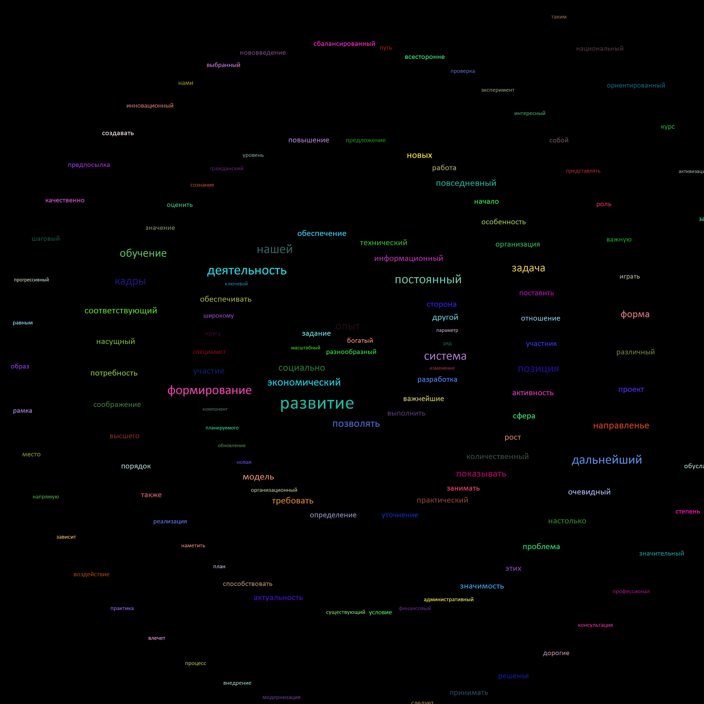

# Cloud Layouter

## usage:

#### you can check all arguments by help(--help)

### example:

```.\TagCloudapp.exe -i Words.txt -o Output1.png -b black -f Calibri -h 2000 -w 2000 -g circle```

## Examples of cloud



