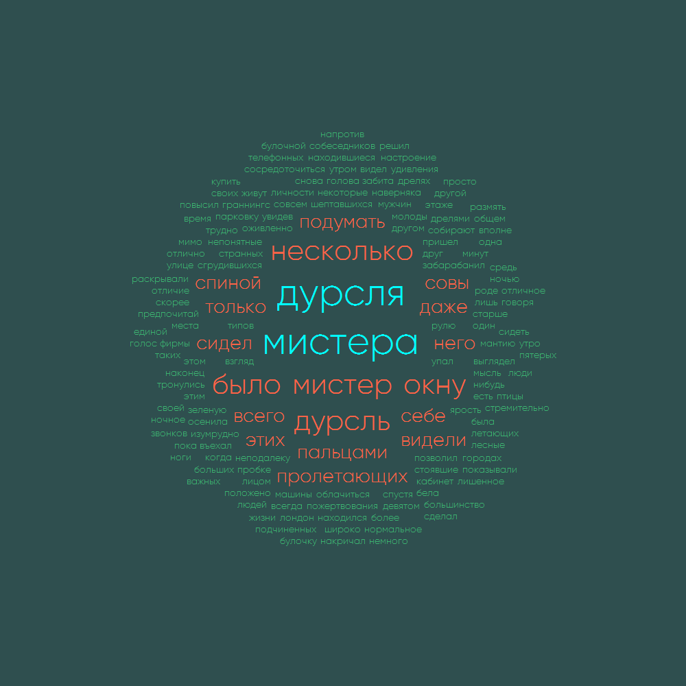

# Tags Cloud Visualizator

Приложение для создания облак тегов на основе текста.

## Настройки

1. Теги

| Свойство        | Описание                                               |
|-----------------|--------------------------------------------------------|
| BackgroundColor | Настраивает фоновый цвет изображения.                  |
| PrimaryColor    | Настраивает первичный цвет тегов.                      |
| SecondaryColor  | Настраивает вторичный цвет тегов.                      |
| TertiaryColor   | Настраивает третичный цвет тегов.                      |
| Font            | Настраивает используемый для отрисовки тегов шрифт.    |
| FontSize        | Настраивает максимальный размер шрифта на изображении. |

2. Источник текста

| Поддерживаемые форматы |
|:----------------------:|
|          .txt          |
|          .doc          |
|          .docx         |

3. Размеры изображения

| Свойство |            Описание            |
|:--------:|:------------------------------:|
|  Height  | Определяет высоту изображения. |
|   Width  | Определяет ширину изображения. |
